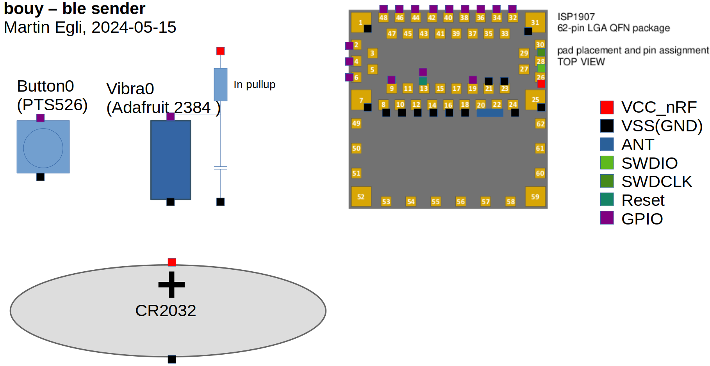

# Lighthouse - Hardware

## basic concept

+ lighthouse
+ buoy: hand sender, ble advertising

## lighthouse - electronics

### main board

- RF-MCU: nRF52840: [113990556 Module](https://www.mouser.ch/ProductDetail/713-113990556) (seeed)

  - SWDIO connector (50 mil header?)
  - RTC (optional): i2c + backup battery CV
  - sound module: [DFPlayer mini](https://wiki.dfrobot.com/DFPlayer_Mini_SKU_DFR0299)
  - display 1: display time
  - display 2: lighting, simulate sunrise
  - Buttons
  - Sensors
    - light sensor
    - rh sensor
    - p sensor

### display

- addressable LEDs: [IN-PI22TAT5R5G5B](https://www.mouser.ch/ProductDetail/743-IN-PI22TAT5R5G5B)

### buoy - electronics

- RF-MCU: nRF52811 module [ISP1907-LL-RS](https://www.mouser.ch/ProductDetail/359-ISP1907-LL-RS)
- battery CR2032
- vibration sensor [Adafruit 2384](https://www.mouser.ch/ProductDetail/485-2384)
- button PTS526 [PTS526 SK15 SMTR2 LFS](https://www.mouser.ch/ProductDetail/611-PTS526SK15SMR2L)

#### schematics

buoy will be soldered together using wire only, no pcb for this.

# links

just a collection of (maybe) useful links

- [markdown cheat sheet](https://www.markdownguide.org/cheat-sheet/)
